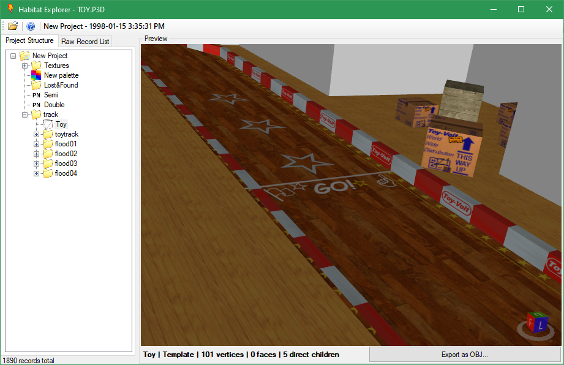

# HabitatExplorer
A tool for exploring Probe Entertainment "Habitat" P3D files, used during the development of Re-Volt

**About the Project**

This project contains two C# projects within it. The viewer application, and libhabitat. libhabitat can be used  to work with Habitat files in any .NET application.

**Features**

- Bitmap, palette, and texture mapping viewers
- Exports OBJ models
- Export textures and palettes
- Allows the copy of the raw data to the clipboard

**Project Status**

Most of the major things are implemented. Enums, property names, and a few others aren't yet implemented.

**Known Issues**

The 3D viewer has a memory leak in it somewhere.
